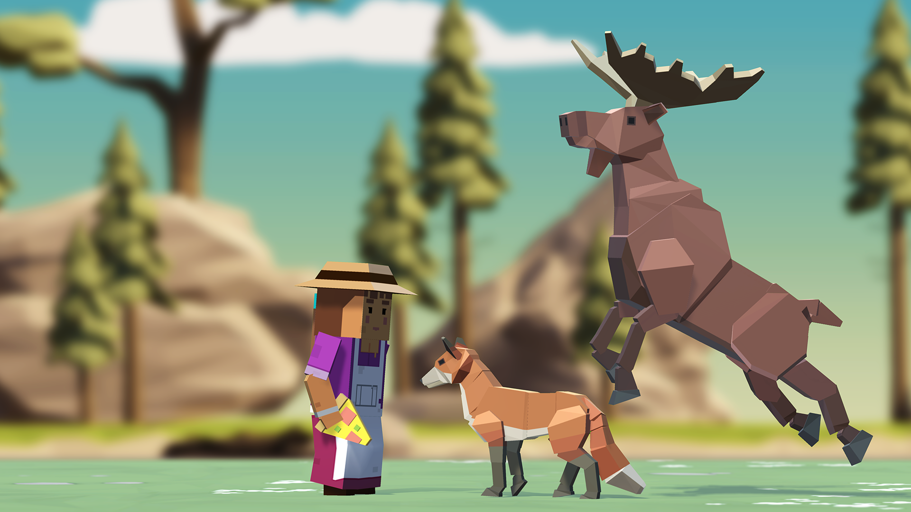

# Unit2-forest

Task-https://learn.unity.com/project/unit-2-basic-gameplay?uv=2020.3&pathwayId=5f7e17e1edbc2a5ec21a20af&missionId=5f71fe63edbc2a00200e9de0

In this module, the top view game is programmed to throw food to hungry animals approaching you before they can run past you. 

A basic game with the ability to launch projectiles and maneuver the player to maintain the game.

